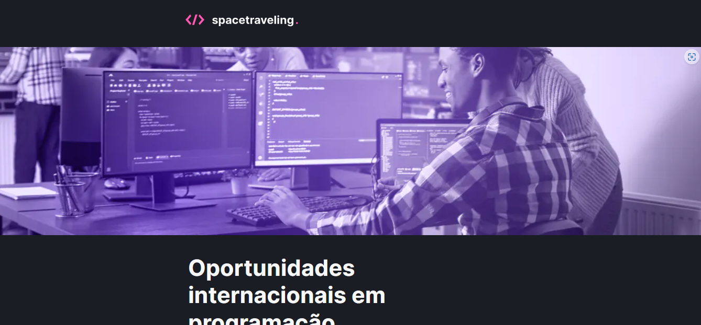

<h1 align="center">
  
</h1>



## Desafio 03 - Ignite (React)

Aplicação desenvolvida para o desafio 03 do Ignite (Trilha React). Um blog de notícias que são alimentas através do CMS Prismic.io com a possibilidade de comentários nos posts utilizando o widget Utterances.

## Tecnologias

- [React](https://pt-br.reactjs.org/)
- [Typescript](https://www.typescriptlang.org/)
- [Next.js](https://nextjs.org/)
- [Prismic.io](https://prismic.io/)
- [React-icons](https://react-icons.github.io/react-icons/)
- [Date-fns](https://date-fns.org/docs/Getting-Started)
- [Sass](https://sass-lang.com/)
- [Utterances](https://utteranc.es/)

## Executando o projeto

Utilize o **yarn** ou o **npm install** para instalar as dependências do projeto.
Em seguida, inicie o projeto.

```
yarn start
```

Lembre-se de obter o access token e api endpoint no Prismic e adicione um arquivo .env.local com as informações.

```
PRISMIC_API_ENDPOINT = ""
PRISMIC_ACCESS_TOKEN = ""
```

### **Projeto desenvolvido por**

[](https://www.linkedin.com/in/joilsonmslopes/)
